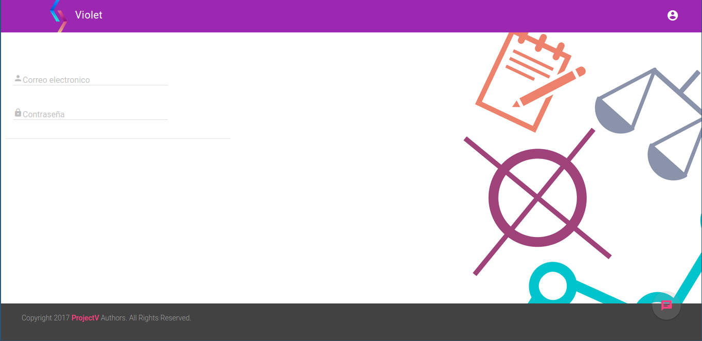

# **PROJECT V** +  [Vuejs](https://vuejs.org) + [Material.io](https://material.io/) + [Flask](http://flask.pocoo.org/)
---

## Intro

Project V(violet) is a project that join all applications of use common
for everybody (end user, entrepreneur). One site, one app.

Now only include this modules:

* [Goal manage](screenshot/Objective.png)
* [Habits control](screenshot/Habit.png)
* [Pending list](screenshot/Pending.png)
* [Project manage](screenshot/Project.png)
    * [Sub task](screenshot/Project-sub-task.png)
    * [Issue](screenshot/Project-issue.png)
* [Pomodoro](screenshot/Pomodoro.png)

## Demo
To check out living example, visit [Violet](http://art0flife-zero1zero.rhcloud.com)

user: demo@demo.demo

password: demo@demo.demo

## Contributing
#### Issue Reporting Guidelines
* Github issues

#### Pull Request Guidelines
* The master branch is basically just a snapshot of the latest stable release.
  All development should be done in dedicated branches.
  Do not submit PRs against the master branch.
* All submit PRs against the dev branch.
* Make your changes in a new git branch:
  ``git checkout -b my-fix-branch master``
* Commit your changes using a descriptive commit message and prefix:
    * ``[IMP]`` for improvements
    * ``[FIX]`` for bug fixes
    * ``[REF]`` for refactoring
    * ``[ADD]`` for adding new resources
    * ``[REM]`` for removing of resources

## Configuration
* Install libraries [requirements.txt](requirements.txt)
* Replace values in file ``flaskapp.cfg``
* Restore ``tools/Db/last release.sql`` on [PostgreSQL](www.postgresql.org)

## License

Licensed under an [Apache-2.0](LICENSE) license.

Copyright © 2016-Present, ProjectV Authors. All Rights Reserved.